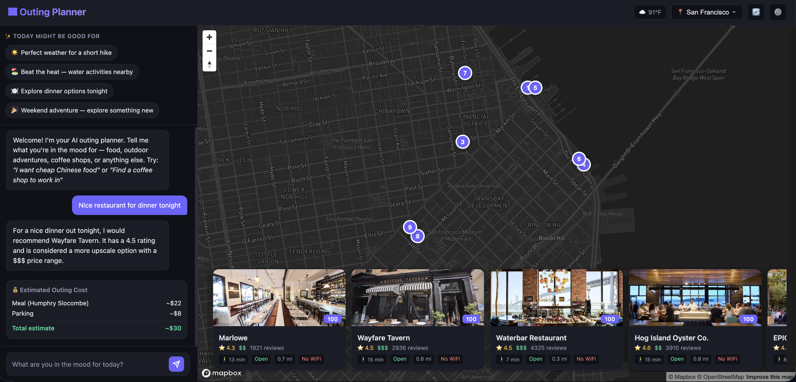
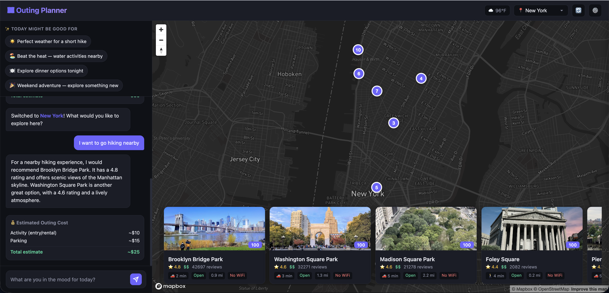
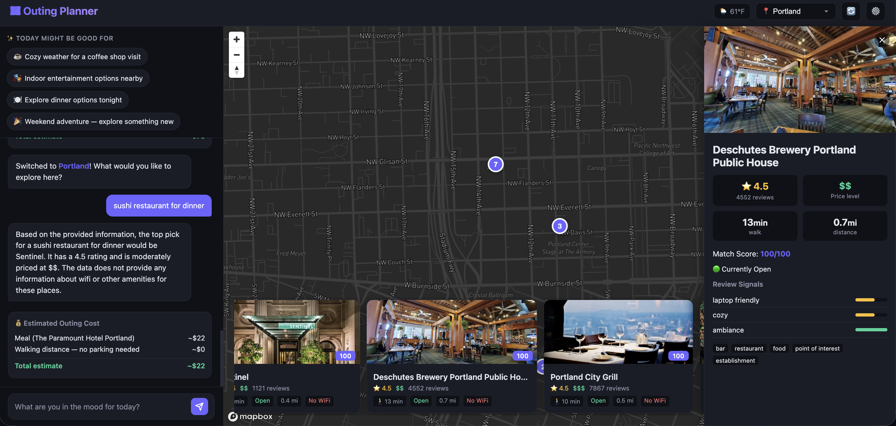

# 🗺️ Outing Planner

An AI-powered web app that suggests serendipitous activities and outings based on what you're looking for and where you are. Uses natural language understanding to parse complex requests like "Find a cozy coffee shop to work in" or "Nice date night restaurant under $50" and returns intelligently ranked recommendations.

## ✨ Key Features

### 1. **Serendipitous Suggestions with Weather & Time Awareness**
Get contextual recommendations based on:
- **Time of day** - Morning coffee spots, lunch venues, evening entertainment
- **Weather conditions** - Indoor activities on rainy days, outdoor activities when sunny
- **Location-based insights** - Real suggestions that actually work for your area

### 2. **Natural Language Intent Parser**
Instead of dropdown menus, just tell the app what you want in plain English:
- "Find a cozy coffee shop to work in" → Understands: work café, WiFi needed, nearby
- "Cheap Chinese food nearby" → Detects: cuisine type, budget constraints, distance
- "Fun things to do" → Recognizes entertainment and activity discovery
- "Hiking trails" → Identifies outdoor activities

The parser automatically extracts:
- **Activity type** (café, dining, entertainment, outdoor)
- **Cuisine preferences** (if applicable)
- **Budget constraints** (cheap, moderate, upscale)
- **Distance preferences** (nearby, walking distance, longer trips)
- **Special requirements** (WiFi for work, romantic for dates, family-friendly)

### 3. **Smart Ranking Algorithm**
Results are ranked using:
- **Review signals** - Extracts WiFi mentions, ambiance cues, noise levels from reviews
- **Distance weighting** - Prioritizes walking-distance locations based on your query
- **Type filtering** - Excludes irrelevant results (e.g., McDonald's when searching for coffee shops)
- **Freshness** - Prioritizes recently reviewed places
- **Relevance scoring** - Matches review content to your specific needs

### 4. **Location Intelligence**
- **Reverse geocoding** - Automatically detects your city when you move the map
- **GPS-aware search** - Centers results around your actual location
- **Saved preferences** - Remember your home location for consistent recommendations
- **Dynamic suggestions** - Different results for different neighborhoods

### 5. **Interactive Map Display**
- See all results on an interactive Mapbox map
- Click to get more details
- Visual distance indicators
- Easy to explore multiple options

## 🎯 What Makes It Different

**Not a generic search tool.** Other apps just list "places matching your query." Outing Planner:
- **Understands context** - "Coffee shop to work in" is different from "coffee shop to grab a quick espresso"
- **Learns from reviews** - Extracts actual insights about WiFi, noise, seating from user reviews
- **Respects constraints** - Knows what "nearby" means for your activity (15 min walk for coffee, 30 min drive for hiking)
- **Surprises you** - Suggests hidden gems, not just the obvious top-rated chains

## 🚀 Quick Start

### Prerequisites
- Python 3.11+
- API keys for:
  - [Google Places API](https://developers.google.com/maps/documentation/places/web-service)
  - [Anthropic Claude API](https://console.anthropic.com)
  - [Mapbox](https://www.mapbox.com) (for the interactive map)
  - OpenWeather (optional, for weather-based suggestions)

### Setup

1. **Clone and install dependencies**
```bash
git clone https://github.com/MallikaKhullar/outing-planner.git
cd outing-planner
pip install -r requirements.txt
```

2. **Configure API keys**
Copy `.env.example` to `.env` and fill in your API keys:
```bash
cp .env.example .env
```

Then edit `.env`:
```
GOOGLE_PLACES_API_KEY=your_key_here
ANTHROPIC_API_KEY=your_key_here
MAPBOX_ACCESS_TOKEN=your_key_here
OPENWEATHER_API_KEY=your_key_here  # optional
```

3. **Start the server**
```bash
python server.py
```

4. **Open in browser**
Navigate to `http://localhost:8080`

## 🎬 Screenshots

### Home Screen - Serendipitous Suggestions


Shows the app's main interface with AI-powered suggestions based on time of day and weather. The left sidebar displays contextual recommendations like "Perfect weather for a short hike" and "Explore dinner options tonight."

### Natural Language Search Results


Type a natural language query like "Find a cozy coffee shop to work in" and get intelligent recommendations. The app parses your intent and returns results ranked by relevance to your specific needs (WiFi availability, noise level, seating, etc.).

### Interactive Map with Results


See all recommendations displayed on an interactive Mapbox map with numbered markers. Each marker is clickable to view detailed place information including ratings, reviews, distance, and travel time.

## 📖 How to Use

1. **Type what you're looking for** - Use natural language, be specific
   - ✅ Good: "Coffee shop with good WiFi to work in"
   - ✅ Good: "Cheap tacos near me"
   - ✅ Good: "Hiking trails for beginners"

2. **Move the map to your location** - Or let it auto-detect your city automatically

3. **Get intelligent suggestions** - See ranked results with distances, reviews, and extracted insights

4. **Click a place** - View full details, ratings, and what reviewers said about key features

## 🛠️ Architecture

**Frontend:**
- Interactive Mapbox GL JS map
- Real-time location detection
- Responsive web interface

**Backend:**
- Tornado async web framework
- Google Places API for place data
- Claude AI for natural language understanding
- SQLite with smart caching (location & conversation aware)
- Review parsing for intelligent signals

**Key Algorithms:**
- NLP intent parser (Claude-powered)
- Smart ranking with multi-signal weighting
- Review signal extraction (WiFi, noise, ambiance mentions)
- Haversine distance calculations
- Location-aware caching to reduce API costs

## 📊 Example Queries

Try these to see the system in action:

- "Find a cozy coffee shop to work in" → Finds cafés with good WiFi/seating
- "Cheap Chinese food nearby" → Budget-friendly restaurants in walking distance
- "Date night restaurant under $50" → Romantic, moderately-priced dining
- "Hiking trails" → Outdoor activities ranked by reviews
- "Fun things to do" → Entertainment venues and attractions
- "Quiet place to read" → Low-noise, bookish cafés and libraries

## 🔒 Privacy & Security

- API keys are kept in `.env` and never committed to git
- All place searches are done server-side
- No user data is stored or shared
- Map tokens are securely injected at runtime

## 📝 Files Overview

- `server.py` - Main Tornado web server
- `ai_engine.py` - Natural language intent parser using Claude
- `places.py` - Google Places API integration
- `ranking.py` - Smart ranking algorithm with review analysis
- `opportunities.py` - Weather & time-based suggestions
- `database.py` - SQLite caching with location awareness
- `templates/index.html` - Interactive frontend with Mapbox

## 🚀 Deployment

See [DEPLOYMENT.md](./DEPLOYMENT.md) for detailed deployment instructions to:
- **Railway** (recommended, $5-10/month)
- **Render**
- **Heroku**

## 🤝 Contributing

Found a bug? Have a feature idea? Open an issue or submit a PR!

## 📄 License

MIT

---

**Made with ❤️ for better outing discovery**
